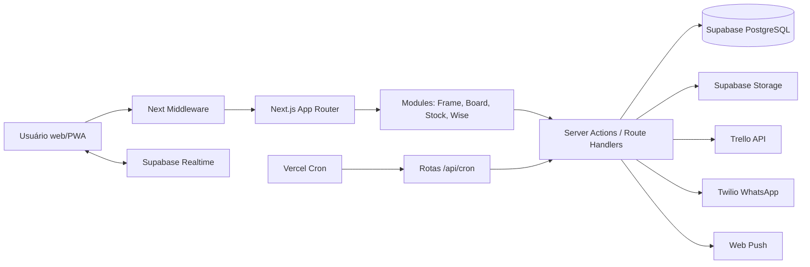
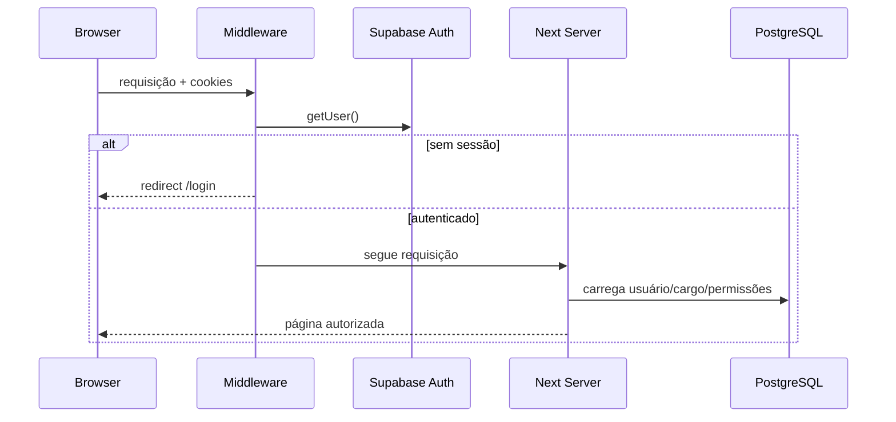
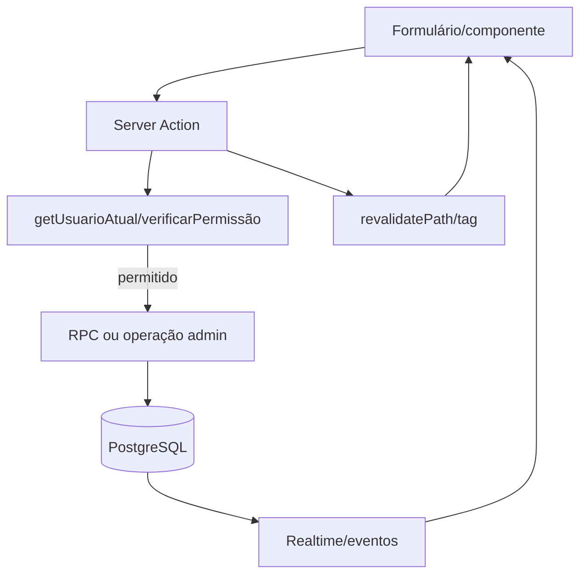
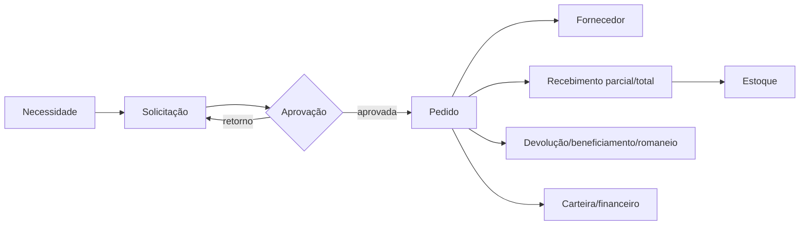
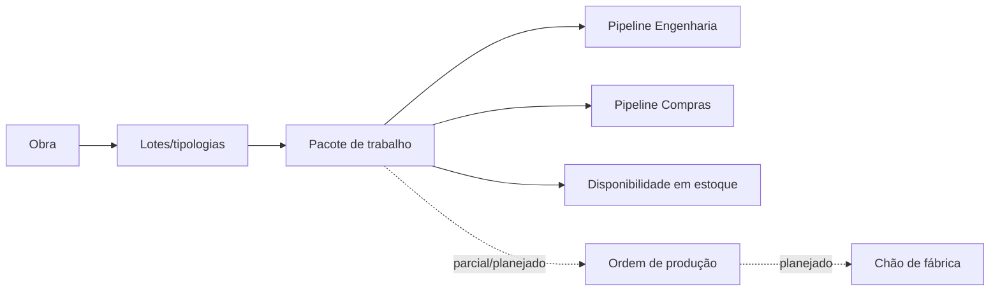
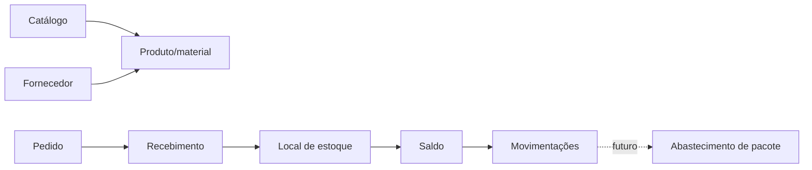
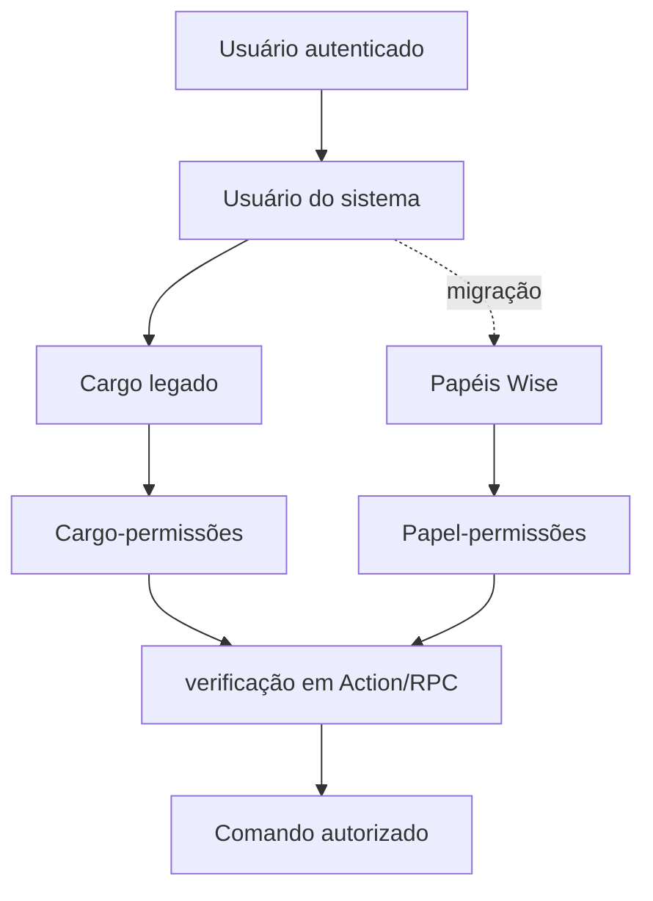
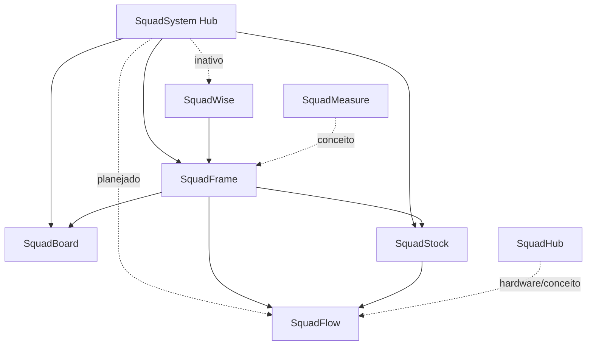

# Arquitetura atual

## Visão geral

Monólito modular Next.js hospedável na Vercel. Server Components e Server Actions acessam Supabase, frequentemente por cliente administrativo. O navegador usa cliente anon para Auth, Realtime e casos específicos. Regras estão concentradas em `sgi/modules`; Wise adota separação repository/service/action mais explícita.

## Autenticação

## Fluxo de dados

## Compras

## Produção

## Estoque

## Permissões

## Relação modular

## Segurança e armazenamento

- Middleware protege páginas, mas exclui `/api`; cada API precisa autenticação própria.
- `createAdminClient` ignora RLS e aparece amplamente. Segurança depende da correção de Actions/services/RPCs.
- Há 132 ocorrências de criação de policies e migrations específicas de RLS, mas a documentação registra lacunas históricas.
- Storage é usado para arquivos/imagens; política de retenção/backup não está documentada no código.
- Realtime usa publicações específicas; filtros client-side não substituem RLS.

## Deploy e operação

Vercel em `gru1`, `maxDuration` 30 s, três crons. Não há Docker nem CI versionado. Deploy automático por push é descrito em `sgi/DEPLOY.md`, mas não substitui gates de qualidade.

